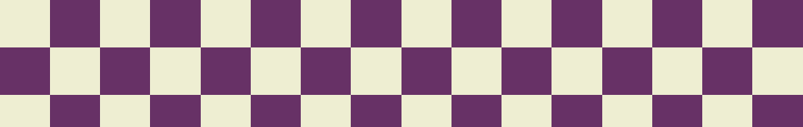
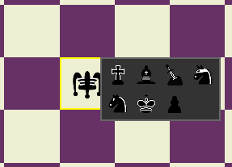
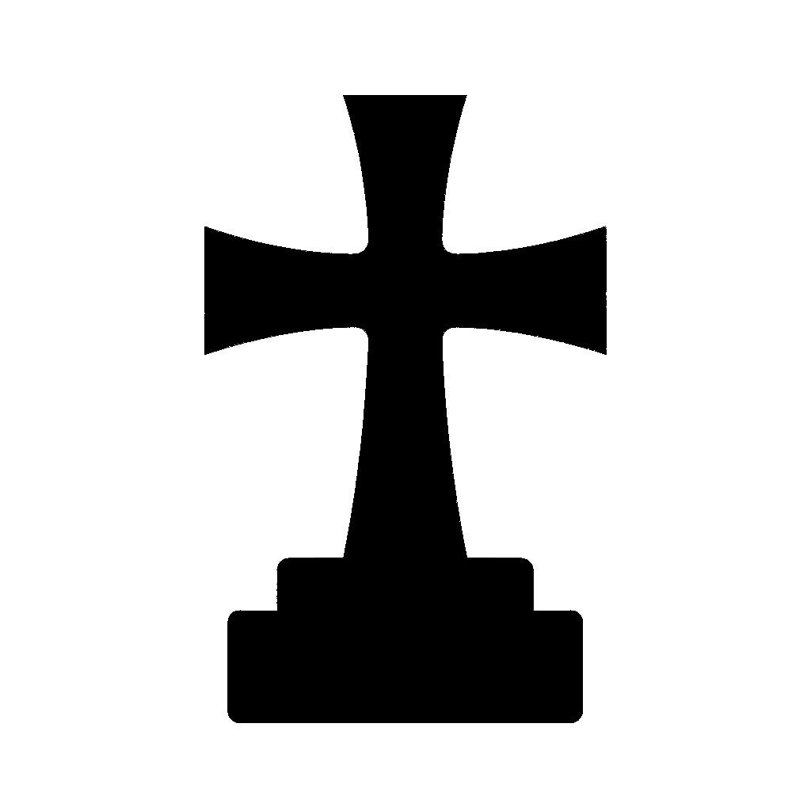
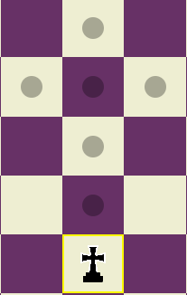
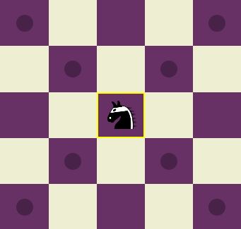
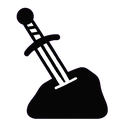
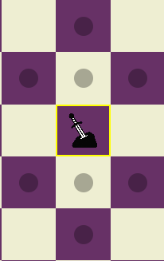

# ♟️ Xadrez 2

Xadrez foi um jogo criado no final do século XV, tendo evoluído de um jogo mais antigo de origem indiana chamado **Chaturanga**.  
Chaturanga teria se espalhado pelo mundo árabe e posteriormente chegado à Europa, sofrendo modificações até chegar no modelo de jogo que temos hoje.  

Apesar disso, as regras, mecânicas e peças do jogo se mantiveram praticamente intocadas por séculos, não sendo percebidas modificações ou inovações que se destacassem a ponto de exigir uma mudança definitiva no jogo.

---

## ♟️ Tentativas de Inovação

Algumas tentativas de mudança chegaram a acontecer. Entre elas, uma das mais populares foi o **Chess960**, variação do xadrez tradicional inventada por *Bobby Fischer*, renomado enxadrista.  

Cansado da monotonia do início das partidas de xadrez, Fischer pensou que seria mais interessante se as peças da primeira fileira do tabuleiro fossem embaralhadas, possibilitando uma maior gama de variações de jogos e exigindo atenção total, e não apenas a memorização de aberturas convencionais.

---

## ♟️ Mas... e se fosse além?

E se, além de embaralhar as peças, Fischer tivesse **inventado novas peças** e aleatorizado também quais peças iriam ao tabuleiro?  

Foi com essa mentalidade que criamos o **Xadrez 2**, o possível sucessor do xadrez, possuindo **4 novas peças**, descritas a seguir:

---

## 🎭 Bobo da Corte

| Peça | Movimentação |
|------|-------------|
|  |  |

Na corte do reino, o Bobo da Corte é um mestre do caos e da imprevisibilidade.  
Ele brinca com a lógica e a ordem, rindo da honra da nobreza e trazendo uma pitada de loucura à seriedade do jogo.

**Movimentação:**  
- Pode imitar a movimentação de qualquer peça do tabuleiro.  
- Só pode voltar a imitar uma determinada peça **depois de ter imitado todas as outras** presentes no tabuleiro.  
  - Exemplo: se ele imitar a Rainha, só poderá voltar a imitá-la depois de ter imitado Torre, Cavalo, Bispo e Rei.

**Detalhe importante:**  
No jogo, suas opções são mostradas ao selecionar o Bobo e clicar com o botão direito, abrindo uma **GUI de seleção** de peças possíveis para imitar.  
Caso o Rei esteja em **check**, a GUI mostrará somente as peças que possam impedir o check, facilitando a experiência do usuário.

---

## ✝️ Templário

| Peça | Movimentação |
|------|-------------|
|  |  |

Poderosa ordem militar católica da Idade Média, criada para proteger os peregrinos cristãos na Terra Santa durante as Cruzadas.  
Extremamente influentes e icônicos na época, agora também presentes no tabuleiro.

**Movimentação:**  
- Move-se em **cruz**, mas somente **para frente e para trás**.

---

## 🕵️ Ladrão

| Peça | Movimentação |
|------|-------------|
|  |  |

O Ladrão é uma figura astuta que vive nas sombras do reino.  
Sem honra ou nobreza, despreza a batalha direta, mas, quando consegue o que quer, foge rapidamente para garantir sua sobrevivência.

**Movimentação:**  
- Similar ao Bispo, mas com alcance de **apenas 2 casas**.  
- Diferencial: ao capturar uma peça, pode **permanecer na casa** ou **recuar antes da vez do adversário**.

---

## 🛡️ Herói

| Peça | Movimentação |
|------|-------------|
|  |  |

O Herói é um cavaleiro honrado que vive para proteger o seu reino e o seu Rei.  
Sua força reside em sua lealdade, e ele luta com uma fúria incontrolável quando seu rei se encontra em perigo.

**Movimentação:**  
- Move-se em **formato de seta**, para frente e para trás.  
- Quando o Rei entra em **check**, seu alcance aumenta em **+1**, permitindo proteger melhor o soberano.

---

## 💻 Xadrez e a Programação Orientada a Objetos

Este projeto foi desenvolvido aplicando conceitos de **POO (Programação Orientada a Objetos)** para estruturar as peças, regras e mecânicas do Xadrez 2, explorando herança, polimorfismo e encapsulamento de forma prática.
